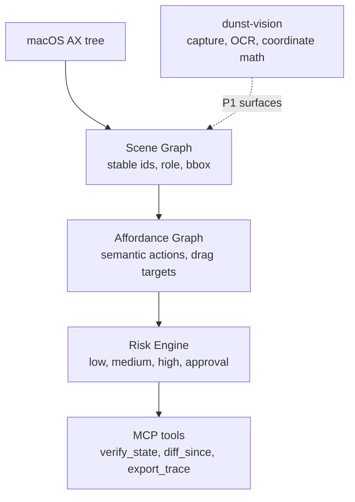

# Dunst — POC

[](https://github.com/azerozero/dunst/actions/workflows/ci.yml)
[](#license)

> From pixels to verified actions. **AX-first slice.**

A macOS daemon that turns a window into a **verifiable affordance graph** for AI
agents. Instead of `Click(x=842, y=661)`, an agent resolves a target by meaning —
a **scene-graph node** (system truth) and its **affordance** (semantic actions +
risk), two distinct objects keyed by the same stable id:

```json
// get_scene_graph (compact projection) — one node
{ "id": "btn_nouvelle_note", "role": "button", "label": "Nouvelle note",
  "bbox": { "x": 1815, "y": 391, "w": 45, "h": 52 },
  "enabled": true, "focused": false, "parent": "toolbar_692558b0", "n_children": 0 }

// get_affordances — the affordance for that same id
{ "id": "btn_nouvelle_note", "actions": ["click"], "drag_targets": [],
  "risk": { "level": "low", "requires_approval": false, "reasons": [] } }
```

(The node carries `confidence`/`source` in the `full` view; the compact projection
drops them. `risk` is the structured `RiskAssessment`, not a bare string.)

## Why this POC is small (and still proves the point)

The full vision (Tile/Foveal/OCR/ScreenCaptureKit, drag&drop, replay…) is large.
This POC proves the **load-bearing hypothesis**: *the macOS Accessibility tree is
rich enough to build the affordance graph without pixels or OCR.*

Validated on Notes (pure AX, no screenshot): 427 elements, each actionable one
already carrying `role`, native `actions`, `label`/`help`, an identifier, and
risk signals in the label text (`Supprimer`, `Éteindre`, …). So the
Tile/Foveal/OCR half is deferred to P1 — only needed for non-AX surfaces.



## Workspace

| Crate                | Role                                                     |
|----------------------|----------------------------------------------------------|
| `dunst-core`     | Frozen contract: types, traits, `MockPerceptor`, fixtures|
| `dunst-graph`    | Pure logic: scene graph, affordances, risk, diff         |
| `dunst-platform` | macOS AX backend: `Perceptor` + `ActionExecutor`         |
| `dunst-vision`   | P1a spike: window capture + Apple Vision OCR + coord math |
| `dunst-mcp`      | Engine (risk gating + audit) + demo + MCP server         |

`graph` and `platform` depend only on `core`. See `docs/README.md` for the
documentation map and `docs/ARCHITECTURE.md` for the current architecture.

**Cross-platform compilation:** only `dunst-vision::coords` (pure coordinate
math) builds on any target; the rest of `dunst-vision` (capture, OCR) and all
of `dunst-platform` are `#[cfg(target_os = "macos")]`. So `cargo test` runs the
full logic/coords suite everywhere, and the macOS-only backends compile on macOS.

## Prerequisites

- macOS for live AX automation. Fixture/demo mode works without a live target.
- Rust 1.80, matching the workspace `rust-version`.
- Accessibility permission for the terminal or MCP host when using live mode.
- Screen Recording permission when using screenshot/OCR tools.

Check the local environment:

```bash
cargo run -p dunst-mcp -- doctor
```

## Run

```bash
# Device-free demo on the Notes fixture: scene -> affordance -> risk gating -> audit
cargo run -p dunst-mcp -- demo

# Build the MCP server used by Codex/Claude stdio clients
cargo build -p dunst-mcp

# Dump a live window's AX tree as JSON (find the pid/window via the MCP host)
cargo run -p dunst-platform --example dump -- <pid> <window_id>
```

The fixture demo prints a scene summary, resolves `Nouvelle note`, executes the
low-risk click, gates a destructive `Supprimer` action as `PendingApproval`, then
exports the audit trail as JSON.

Expected shape:

```text
# Dunst MCP demo — Notes (fixture, AX-only)
scene graph: 427 nodes, 1 root(s), window "Notes"
-> result=Success
-> result=PendingApproval
```

Exit-code expectations:

| Command | Success | Failure |
|---------|---------|---------|
| `dunst-mcp demo` | `0` when the fixture loads and the scripted path completes | `1` on fixture or engine initialisation failure |
| `dunst-mcp serve` | `0` when the stdio loop exits normally | `1` when an explicitly requested live target cannot be resolved |
| `dunst-mcp doctor` | `0` when the local environment is usable for live automation | `1` when Accessibility is missing or the platform is unsupported |
| `dunst-mcp setup` | `0` after printing config snippets | clap exits non-zero for invalid arguments |

## MCP client setup

The MCP server binary is `dunst-mcp`; the server identifies itself as `dunst`.
For local clients, use `scripts/mcp-dunst.sh` as the stdio entrypoint. The
wrapper builds `target/debug/dunst-mcp` if needed, keeps stdout clean for
JSON-RPC, then starts `dunst-mcp serve --live`.

Print config snippets without writing user files:

```bash
cargo run -p dunst-mcp -- setup --client codex
cargo run -p dunst-mcp -- setup --client claude --dev-wrapper
```

Codex can load the project-local registration in `.codex/config.toml` after a
restart. Claude-style clients can use `.mcp.json`. The project-local configs use
the relative `scripts/mcp-dunst.sh` wrapper. Installed user-level configs should
prefer `dunst-mcp serve` from `PATH`.

The Codex config uses `startup_timeout_sec = 120` because the development
wrapper may need to build `target/debug/dunst-mcp` before the MCP handshake.
Installed configs that call a prebuilt `dunst-mcp` binary can use a shorter
timeout.

To pin startup to an app:

```bash
DUNST_MCP_APP="Google Chrome" scripts/mcp-dunst.sh
```

App lifecycle tools:

- `list_apps` lists GUI apps that are already running.
- `list_launchable_apps` scans installed `.app` bundles without launching them.
- `app_info` reads one app's `Info.plist` metadata by name, bundle id, or path.
- `launch_app` starts an app in the background, optionally with a URL and args.
- `close_app` asks an app to quit cleanly by name.

Display/window view tools:

- `list_displays` lists active screens with Dunst's 1-based index, global bounds,
  pixel resolution, scale, and main-display flag.
- `window_view` returns a compact scoped view of the target window: owning
  display, window bounds, position relative to that display, visible text, and
  key elements without dumping the full AX graph.
- `desktop_view` returns the display/window topology with front/back `z_order`,
  frontmost window, owning display, and geometric overlap lists. If CoreGraphics
  cannot provide a real display topology, it returns `degraded:true` with a
  `reason` instead of fabricating a `0x0` display.
- `visual_change_probe` captures a screen region, samples a spaced luminance grid,
  compares it with the previous probe, and can run a full AX refresh when pixels
  changed. AX cannot refresh only one rectangle; the pixel probe is the cheap
  invalidation signal.
- `analyze_region_ax` samples a screen region with AX hit-tests and returns the
  unique shallow AX elements under that grid. macOS does not expose a direct
  subtree-by-rectangle refresh, but this is targeted AX analysis for one zone.
- `move_window_to_display` moves the target window to a display index from
  `list_displays`, centering it and preserving size by default.
- `move_app_to_display` moves all sizeable top-level windows for a running app
  to a display index from `list_displays`.
- `arrange_windows` tiles selected windows on a display as `grid`, `columns`,
  `rows`, `cascade`, or `maximize`; selection must be explicit through
  `window_ids`, `app`, or `all:true`.

Display bounds use macOS global screen points; external displays can have
negative `x`/`y` coordinates depending on Arrangement. Window moves require
Accessibility permission and can fail if an app or Space refuses AX position/size
changes.

Performance controls:

- Every MCP `tools/call` result includes `_meta.dunst.timing_ms` and
  `_meta.dunst.tool` for per-tool latency profiling.
- Read-orientation tools such as `find_element`, `page_state`, and `window_view`
  use a short AX refresh TTL by default. Pass `force_refresh:true` to bypass it.
- Mutating action paths still force a full AX refresh after execution.
- `read_text` captures only the requested screen `region` when one is provided,
  instead of capturing the whole target window and cropping later.
- `visual_change_probe` samples grayscale/luminance cells instead of keeping all
  colour channels. The main speed win is still the smaller captured region; luma
  sampling reduces comparison work and memory.
- Display and desktop topology are cached briefly; window move/arrange tools
  invalidate the desktop cache after changing geometry.
- `DUNST_AX_MAX_NODES` and `DUNST_AX_MAX_DEPTH` can lower AX traversal caps for
  very large/noisy apps.

To serve the deterministic fixture instead of a live window:

```bash
DUNST_MCP_MODE=fixture scripts/mcp-dunst.sh
```

`DUNST_MCP_ENABLE_APPROVE_TOOL=1` opt-ins to the operator-side `approve` tool for
controlled local sessions. It is not advertised by default.

Homebrew is a good later packaging target for a stable CLI, but the repo-local
wrapper is better during development: it always runs the current checkout, builds
when the debug binary is missing, and keeps Codex/Claude config pointed at the
code under test. A future formula should install the compiled `dunst-mcp` binary
and use the same `serve` entrypoint.

The `demo` narrates: resolve "Nouvelle note" by **label** → click → a destructive
`Supprimer`/`Éteindre` is **denied pending approval** → approve → proceed →
audit trail exported as JSON.

## Development

Run the same core checks as CI:

```bash
cargo fmt --all -- --check
cargo clippy --workspace --all-targets --all-features -- -D warnings
cargo test --workspace --all-targets --locked
shellcheck scripts/*.sh
```

Live smoke is macOS-only and requires Accessibility permission:

```bash
scripts/smoke-live.sh Notes
```

## Status

POC / work in progress. Differentiator vs raw computer-use drivers: the semantic
layer — stable IDs, affordance normalisation, **risk-based approval gating**,
verify-loop and audit trail — not pixel OCR.

## License

Licensed under either MIT or Apache-2.0, at your option. See `LICENSE-MIT`,
`LICENSE-APACHE`, and `LICENSE`.
