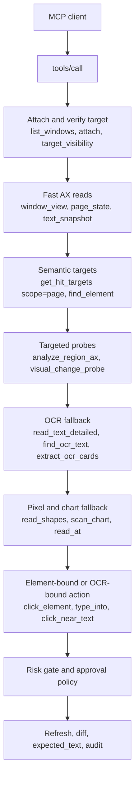

# Dunst

[](https://github.com/azerozero/dunst/actions/workflows/ci.yml)
[](https://github.com/azerozero/dunst/releases)
[](#prerequisites)
[](#license)

> Drive a macOS app from an AI agent by *meaning*, not pixel coordinates — Dunst
> reads the UI as a risk-annotated affordance graph and runs only verified,
> approved actions.

A macOS daemon that turns a window into a **verifiable affordance graph** for AI
agents. Instead of `Click(x=842, y=661)`, an agent resolves a target by meaning —
a **scene-graph node** (system truth) and its **affordance** (semantic actions +
risk), two distinct objects keyed by the same stable id:

```json
// get_scene_graph (compact projection) — one node
{ "id": "btn_nouvelle_note", "role": "button", "label": "Nouvelle note",
  "bbox": { "x": 1815, "y": 391, "w": 45, "h": 52 },
  "enabled": true, "focused": false, "parent": "toolbar_692558b0", "n_children": 0 }

// get_hit_targets — the agent-facing target for that same id
{ "id": "btn_nouvelle_note", "label": "Nouvelle note", "role": "button",
  "safe_click": { "center": [1837.5, 417.0], "source": "accessibility_bbox_inset" },
  "action_modes": [{ "action": "click", "tool_hint": "click_element" }],
  "risk": { "level": "low", "requires_approval": false, "reasons": [] } }
```

(The node carries `confidence`/`source` in the `full` view; the compact projection
drops them. `risk` is the structured `RiskAssessment`, not a bare string.)

## Quickstart

```bash
# 1. Device-free demo — no macOS permissions needed: scene → affordance → risk gate → audit
cargo run -p dunst-mcp -- demo

# 2. Check the machine is ready for live automation (Accessibility / Screen Recording)
cargo run -p dunst-mcp -- doctor

# 3. Preview an MCP client registration (Codex/Claude), then serve a live window
cargo run -p dunst-mcp -- setup --client codex --dry-run
```

New here? Read [How Dunst Reads And Acts](#how-dunst-reads-and-acts) for the model,
or jump to [MCP client setup](#mcp-client-setup) to connect an agent.

## How Dunst Reads And Acts

Dunst is used from an MCP client first. The engine starts by confirming the
target window, then walks the cheapest reliable information path before falling
back to slower or riskier surfaces. Raw screen input is the last resort, not the
default.


```mermaid
flowchart TD
    Client[MCP client] --> Call[tools/call]
    Call --> Target[Attach and verify target<br/>list_windows, attach, target_visibility]
    Target --> AXFast[Fast AX reads<br/>window_view, page_state, text_snapshot]
    AXFast --> AXQuery[Semantic targets<br/>get_hit_targets scope=page, find_element]
    AXQuery --> Targeted[Targeted probes<br/>analyze_region_ax, visual_change_probe]
    Targeted --> OCR[OCR fallback<br/>read_text_detailed, find_ocr_text, extract_ocr_cards]
    OCR --> Pixels[Pixel and chart fallback<br/>read_shapes, scan_chart, read_at]
    Pixels --> Action[Element-bound or OCR-bound action<br/>click_element, type_into, click_near_text]
    Action --> Gate[Risk gate and approval policy]
    Gate --> Verify[Refresh, diff, expected_text, audit]
```

Information ladder, from fastest and most practical to slowest:

1. **Target scope**: `list_windows`, `attach`, `target_visibility`,
   `expose_target_window`, and `list_browser_tabs` make sure Dunst is reading the
   intended window, not a covered or stale browser tab.
2. **AX semantic targets**: `get_hit_targets(scope=page)`, `window_view`,
   `page_state`, `text_snapshot`, and `find_element` are the preferred path for
   native apps and accessible web UI. `get_hit_targets` returns labels, roles,
   safe click zones, action modes, risk, selected tab, visibility, and a
   `ui_epoch` fingerprint so stale coordinates can be discarded after a move,
   resize, tab switch, or user interaction.
3. **Targeted probes**: `analyze_region_ax` and `visual_change_probe` inspect one
   region when a full AX refresh is too broad or not moving.
4. **OCR fallback**: `read_text_detailed(content_only=true)`, `find_ocr_text`,
   `extract_ocr_cards`, `detect_modal`, and `dismiss_modal` handle web canvases,
   cards, popups, and pages that expose only a root group.
5. **Pixel/chart fallback**: `read_shapes`, `scan_chart`, `read_at`, and
   `read_series` are for custom-drawn UI, charts, and hover surfaces.
6. **Raw input fallback**: `click_at`, `press_key`, `hotkey`, and `type_keys` are
   gated, audited, and should follow a visibility check plus a postcondition.

## Why The AX Slice Still Matters

The full vision path (Tile/Foveal/OCR/ScreenCaptureKit, drag and drop, replay)
is large. This POC proves the load-bearing hypothesis: the macOS Accessibility
tree is rich enough to build the first affordance graph without pixels or OCR.

Validated on Notes (pure AX, no screenshot): 22 elements, each actionable one
already carrying `role`, native `actions`, `label`/`help`, an identifier, and
risk signals in the label text (`Supprimer`, `Éteindre`, ...). Vision and OCR
are now fallbacks for non-AX surfaces, not the entrypoint.

## Workspace

| Crate                | Role                                                     |
|----------------------|----------------------------------------------------------|
| `dunst-core`     | Frozen contract: types, traits, `MockPerceptor`, fixtures|
| `dunst-graph`    | Pure logic: scene graph, affordances, risk, diff         |
| `dunst-platform` | macOS AX backend: `Perceptor` + `ActionExecutor`         |
| `dunst-vision`   | macOS capture + Apple Vision OCR + CV shapes/zones + coord math |
| `dunst-mcp`      | Engine (risk gating + audit) + demo + MCP server         |

`graph` and `platform` depend only on `core`. See `docs/README.md` for the
documentation map and `docs/ARCHITECTURE.md` for the current architecture.

**Cross-platform compilation:** only `dunst-vision::coords` (pure coordinate
math) builds on any target; the rest of `dunst-vision` (capture, OCR) and all
of `dunst-platform` are `#[cfg(target_os = "macos")]`. So `cargo test` runs the
full logic/coords suite everywhere, and the macOS-only backends compile on macOS.

## Prerequisites

- macOS for live AX automation. Fixture/demo mode works without a live target.
- Rust 1.85, matching the workspace `rust-version`.
- Accessibility permission for the terminal or MCP host when using live mode.
- Screen Recording permission when using screenshot/OCR tools.

Check the local environment:

```bash
cargo run -p dunst-mcp -- doctor
```

## Run

```bash
# Install the released binary (arm64 + x86_64 bottles from GitHub Releases)
brew install azerozero/tap/dunst-mcp

# Device-free demo on the Notes fixture: scene -> affordance -> risk gating -> audit
cargo run -p dunst-mcp -- demo

# Build the MCP server used by Codex/Claude stdio clients
cargo build -p dunst-mcp

# Install the dunst-mcp binary onto PATH (~/.cargo/bin) so MCP hosts launch it
# directly as `dunst-mcp serve ...`; re-run with --force to update after a pull
cargo install --path crates/dunst-mcp

# Dump a live window's AX tree as JSON (find the pid/window via the MCP host)
cargo run -p dunst-platform --example dump -- <pid> <window_id>
```

Ensure `~/.cargo/bin` is on your `PATH` (it is by default with a rustup install)
so the MCP host can find `dunst-mcp`. No Rust toolchain? Two options:
`brew install azerozero/tap/dunst-mcp`, or download a prebuilt `dunst-mcp`
binary from a tagged [GitHub Release](https://github.com/azerozero/dunst/releases),
`chmod +x` it, and move it onto your `PATH`.

The fixture demo prints a scene summary, resolves `Nouvelle note`, executes the
low-risk click, gates a destructive `Supprimer` action as `PendingApproval`, then
exports the audit trail as JSON.

Expected shape:

```text
# Dunst MCP demo — Notes (fixture, AX-only)
scene graph: 22 nodes, 2 root(s), window "Notes – Aucune note"
-> result=Success
-> result=PendingApproval
```

Exit-code expectations:

| Command | Success | Failure |
|---------|---------|---------|
| `dunst-mcp demo` | `0` when the fixture loads and the scripted path completes | `1` on fixture or engine initialisation failure |
| `dunst-mcp serve` | `0` when the stdio loop exits normally | `1` when an explicitly requested live target cannot be resolved |
| `dunst-mcp doctor` | `0` when all checks pass (or info-only) | `1` on warnings (degraded but usable), `2` when a check fails (Accessibility, Screen Recording, config, or platform) |
| `dunst-mcp setup` | `0` after dry-run/edit output or successful apply/migrate | `1` on invalid config merge/write or clap exits non-zero for invalid arguments |

## MCP client setup

The MCP server binary is `dunst-mcp`; the server identifies itself as `dunst`.
For local clients, use `scripts/mcp-dunst.sh` as the stdio entrypoint. The
wrapper builds `target/debug/dunst-mcp` if needed, keeps stdout clean for
JSON-RPC, then starts `dunst-mcp serve --live`.

Inspect or write config snippets:

```bash
cargo run -p dunst-mcp -- setup --client codex --dry-run
cargo run -p dunst-mcp -- setup --client claude --dry-run --dev-wrapper
cargo run -p dunst-mcp -- setup --client codex --apply
cargo run -p dunst-mcp -- setup --client claude --migrate
```

Codex can load the project-local registration in `.codex/config.toml` after a
restart. Claude-style clients can use `.mcp.json`. The project-local configs use
the relative `scripts/mcp-dunst.sh` wrapper. Installed user-level configs should
prefer `dunst-mcp serve` from `PATH`.

The Codex config uses `startup_timeout_sec = 120` because the development
wrapper may need to build `target/debug/dunst-mcp` before the MCP handshake.
Installed configs that call a prebuilt `dunst-mcp` binary can use a shorter
timeout.

Use `setup --edit` to print the current file and merged result without writing,
and `setup --config PATH` for tests or non-standard client paths. `setup --apply`
chooses the command it writes by context: inside a repo checkout (where
`scripts/mcp-dunst.sh` exists), or with `--dev-wrapper`, it writes the wrapper;
otherwise it writes `dunst-mcp serve` from `PATH` — so it never rewrites the
project's committed config to a binary that may be absent from `PATH`. Both
`setup` and `doctor` accept `--json` for machine-readable output. A compact
device-free MCP transcript lives at `docs/fixtures/mcp-transcript.jsonl`; keep it
updated when tool names or core response shapes change.

### Tool surface

Dunst advertises **73 tools** by default (76 registered; the 3 operator-approval
tools are gated behind `DUNST_MCP_ENABLE_APPROVE_TOOL`). An MCP client discovers
the live set via `tools/list`. By capability:

| Capability | What it covers | Representative tools |
|-----------|----------------|----------------------|
| Orientation & state | build id, backend capabilities, re-perceive, scene/graph views, page/text snapshots, window/desktop topology, visibility | `version`, `platform_capabilities`, `refresh`, `get_scene_graph`, `page_state`, `window_view`, `target_visibility` |
| Query & perception | affordances, semantic hit targets, element/text search, OCR, shapes, zones, cards, choice model | `get_hit_targets`, `find_element`, `read_text`, `read_shapes`, `read_zones`, `extract_ocr_cards`, `enumerate_choices` |
| Element actions | click/type/pick/hover/drag/raise on AX elements, OCR-bound clicks, native file chooser | `click_element`, `type_into`, `pick_option`, `drag_element`, `click_near_text`, `select_file` |
| Batch | apply a whole choice plan behind one operator approval | `apply_selections` |
| Pointer & charts | raw / borrowed-cursor point reads, chart scan, focus-without-raise, cursor recovery | `read_at`, `read_series`, `scan_chart`, `focus_window`, `unstick_cursor` |
| Windows & apps | list/move/arrange windows, displays, attach, launch/close, open URL, navigate, screenshot | `list_windows`, `arrange_windows`, `list_displays`, `attach`, `launch_app`, `navigate`, `screenshot` |
| Keyboard, menus & audit | keys/hotkeys/scroll/zoom, menu-bar menus, state verify, scene diff, trace export | `press_key`, `type_keys`, `scroll`, `open_menu`, `verify_state`, `diff_since`, `export_trace` |
| Operator approvals (gated) | approve / pre-authorize / revoke — off by default | `approve`, `preauthorize`, `revoke_preauthorization` |

The full per-tool reference (all 76, one line each) lives in
[`docs/AGENT_GUIDE.md`](docs/AGENT_GUIDE.md#mcp-tool-reference-all-76-tools).

### Environment & tuning

| Variable | Effect |
|----------|--------|
| `DUNST_MCP_MODE=fixture` | serve the deterministic Notes fixture instead of a live window (read by `scripts/mcp-dunst.sh` only, not by the bare binary) |
| `DUNST_MCP_APP="<name>"` | pin startup to a named app (e.g. `"Google Chrome"`) (read by `scripts/mcp-dunst.sh` only, not by the bare binary) |
| `DUNST_MCP_ENABLE_APPROVE_TOOL=1` | advertise the operator-side `approve` / `preauthorize` / `revoke_preauthorization` tools (off by default) |
| `DUNST_AX_MAX_NODES`, `DUNST_AX_MAX_DEPTH` | lower AX traversal caps for very large or noisy apps |
| `DUNST_MCP_AGENT_ID` | stable, human-readable agent label recorded in audit provenance |

Every `tools/call` result carries `_meta.dunst.timing_ms` and `_meta.dunst.tool`
for per-tool latency profiling. Read-orientation tools reuse a short AX-refresh
TTL (pass `force_refresh:true` to bypass); mutating actions always re-perceive.

The supported entrypoints — all of which run `dunst-mcp serve` — are the
Homebrew formula (`brew install azerozero/tap/dunst-mcp`, stable), a prebuilt
binary from GitHub Releases (stable), and the repo-local `scripts/mcp-dunst.sh`
wrapper (development).

## Development

See [`CONTRIBUTING.md`](CONTRIBUTING.md) for the full guide — branch policy,
Conventional Commits, and the review flow. The essentials, mirrored here:

Run the same core checks as CI:

```bash
cargo fmt --all -- --check
cargo clippy --workspace --all-targets --all-features -- -D warnings
cargo test --workspace --all-targets --locked
shellcheck scripts/*.sh
```

Install local Git hooks with [prek](https://github.com/j178/prek):

```bash
brew install j178/tap/prek
prek install
```

The hooks run `cargo fmt`, `clippy`, `shellcheck`, `gitleaks`, and offline
`lychee` before commits. Heavier checks (`cargo deny`, `cargo audit`,
`cargo machete`, doc-coverage, artifact sweep) run before pushes. Tests are **not**
in the push gate — CI runs them on macOS + Linux, along with the online Markdown
and link checks. See [`CONTRIBUTING.md`](CONTRIBUTING.md) and `CLAUDE.md` for the
authoritative gate description.

Live smoke is macOS-only and requires Accessibility permission; screenshot/OCR
paths also require Screen Recording:

```bash
scripts/smoke-live.sh Notes
```

Branch policy: `main` should be protected before release distribution. In the
current repository, GitHub reports `main` as unprotected and the rulesets API
returns `403`, so this environment cannot enforce the policy directly. Until
rulesets/branch protection are available, green CI plus manual review is the
required merge gate.

## Status

POC / work in progress. What sets Dunst apart from raw computer-use drivers is the
semantic layer, not pixel OCR:

- **Stable IDs** — targets resolve by meaning and survive re-perception.
- **Affordance normalisation** — one semantic action model across AX, OCR, and CV.
- **Risk-based approval gating** — destructive / financial actions block until an operator approves.
- **Verify-loop + audit trail** — every action re-perceives and records a before/after diff.

## License

Licensed under the **Apache License, Version 2.0**. See [`LICENSE`](LICENSE),
[`LICENSING.md`](LICENSING.md), and [`NOTICE`](NOTICE).
