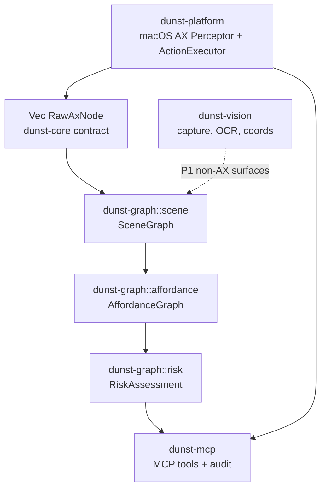

# Dunst MCP — POC Architecture

> AX-first slice. From a macOS window's accessibility tree to a verifiable
> affordance graph exposed over MCP. Vision/OCR/Tile/Foveal are deferred (P1).

## Thesis (validated)

A pulled AX tree of a native macOS app (Notes, 427 elements) already carries
everything the Scene/Affordance graph needs — role, native actions, label/help,
a stable-ish identifier, and risk signals in the labels (`Supprimer`,
`Éteindre`, …). So the affordance graph is ~free from AX; pixels/OCR are only
needed for non-AX surfaces (later phase).

## Pipeline

## Crates & ownership

| Crate                  | Owner            | Depends on        | Touches macOS? |
|------------------------|------------------|-------------------|----------------|
| `dunst-core`       | shared contract | serde             | no             |
| `dunst-graph`      | pure graph logic| core              | no             |
| `dunst-platform`   | macOS backend   | core              | yes (FFI)      |
| `dunst-vision`     | vision/OCR P1   | core              | yes, except coords |
| `dunst-mcp`        | server/runtime  | core+graph+platform+vision | wiring |

`graph` and `platform` depend **only** on `core` — never on each other. This is
what lets the two tracks run in parallel with zero merge conflict: they edit
disjoint directories.

## The contract (frozen — do not edit `dunst-core` casually)

- `RawAxNode` — exactly what a Perceptor emits (tree).
- `SceneGraph` / `SceneNode` — normalised, id-keyed, with stable IDs.
- `AffordanceGraph` / `Affordance` / `SemanticAction`.
- `RiskAssessment` / `RiskLevel`.
- `GraphDiff` / `NodeChange` / `AuditEntry`.
- traits `Perceptor`, `ActionExecutor`; `Target`, `WindowRef`.
- `MockPerceptor` + `fixtures/notes.json` — device-free test source.

If you believe the contract is wrong, **do not change it** — leave a note in
your WP file / ping the architect. Changing core breaks the other track.

## Rules for worker agents

1. Edit **only** files inside your assigned crate. Do not touch `dunst-core`
   or another worker's crate unless the contract change is intentional.
2. **Do not run `git`.** The architect owns all commits (avoids git races since
   both agents share one working tree).
3. Keep `cargo build` and `cargo test -p <your-crate>` green when you finish.
4. No new heavy deps without need; `graph` must stay macOS-free.

## Demo (integration target)

On the Notes window: `find_element(label="Nouvelle note")` → `click_element` →
`verify_state` + `diff_since` prove the change. Then `click_element` on
`Supprimer` / `Éteindre` is **denied pending approval** by the Risk Engine. The
audit trail records before/after + diff + reasoning per action.
