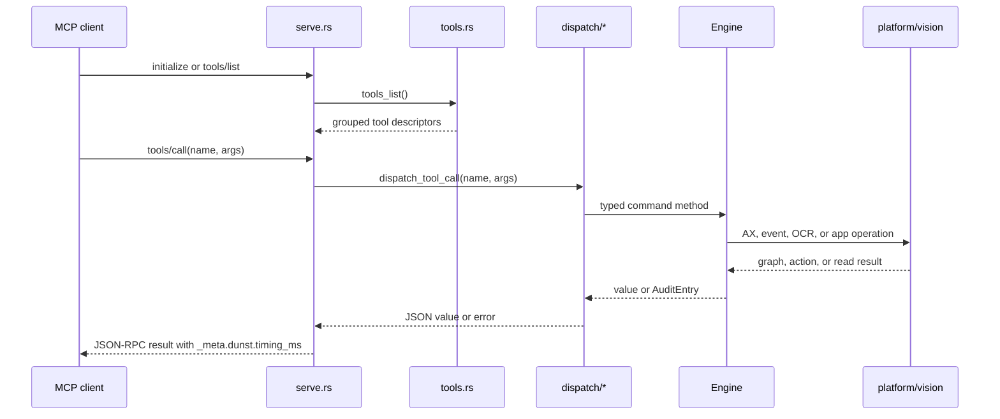
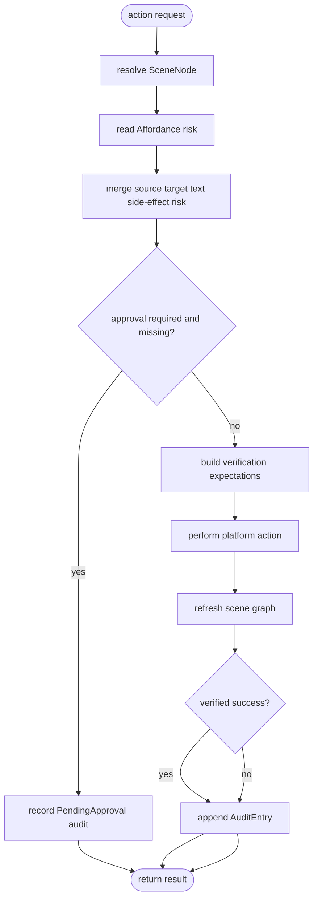

# Code Navigation Map

This file is the short path through the codebase for reviewers, maintainers, and
automation agents. It describes what exists now, where to start reading, and
which paths are sensitive.

## First reads

Read in this order when you need a working mental model:

| Step | File | Why it matters |
|------|------|----------------|
| 1 | `README.md` | User-facing purpose, setup, and MCP surface overview. |
| 2 | `docs/ARCHITECTURE.md` | Crate-level dataflow and ownership boundaries. |
| 3 | `docs/CONTRACTS.md` | Behavior that must change only with tests. |
| 4 | `crates/dunst-mcp/src/serve.rs` | MCP stdio request loop and response shaping. |
| 5 | `crates/dunst-mcp/src/serve/tools.rs` | Tool catalog grouped by tool families. |
| 6 | `crates/dunst-mcp/src/serve/dispatch.rs` | Tool-call router split by command family. |
| 7 | `crates/dunst-mcp/src/engine.rs` | Engine facade and domain modules. |
| 8 | `crates/dunst-mcp/src/engine/action.rs` | Risk gate, execution, verification, and audit path. |

## Crate map

<!-- Schema source: Cargo.toml and crates/*/Cargo.toml -->

```mermaid
flowchart TB
    core[dunst-core contracts]
    graph[dunst-graph scene and risk]
    platform[dunst-platform macOS backend]
    vision[dunst-vision capture OCR shapes]
    mcp[dunst-mcp server and engine]

    graph -->|uses contracts| core
    platform -->|implements traits| core
    vision -->|uses shared types| core
    mcp -->|uses contracts| core
    mcp -->|builds graph views| graph
    mcp -->|drives AX actions| platform
    mcp -->|reads OCR and pixels| vision
```

The dependency direction stays one-way into `dunst-mcp`; lower crates must not
call back into the MCP layer.

## Tool call flow

<!-- Schema source: crates/dunst-mcp/src/serve.rs, serve/tools.rs, serve/dispatch.rs -->



`serve/tools.rs` is declarative catalog data. `serve/dispatch/*` is executable
argument parsing and routing. Keep those responsibilities separate.

## Action gate flow

<!-- Schema source: crates/dunst-mcp/src/engine/action.rs and docs/CONTRACTS.md -->



Do not optimize away risk evaluation, approval checks, refresh, verification, or
audit writes. They are behavioral semantics, not incidental overhead.

## Source layout

```text
dunst-mcp/
├── crates/                 # Rust workspace crates
│   ├── dunst-core/         # Shared contracts and mocks
│   ├── dunst-graph/        # Pure scene, affordance, risk, diff logic
│   ├── dunst-platform/     # macOS Accessibility and event backend
│   ├── dunst-vision/       # Capture, OCR, shapes, coordinate helpers
│   └── dunst-mcp/          # MCP server, engine facade, CLI
├── docs/                   # Architecture, contracts, reviews, plans
├── scripts/                # MCP wrapper and smoke scripts
├── fixtures/               # Device-free AX fixture data
└── .github/                # CI workflows
```

## Edit zones

| Goal | Start here | Validate with |
|------|------------|---------------|
| Add or rename an MCP tool | `serve/tools.rs`, then matching `serve/dispatch/*` | `cargo test -p dunst-mcp --test cli` plus workspace tests |
| Change risk gating | `engine/action.rs`, `dunst-graph/src/risk.rs` | Contract tests in `engine/tests/*` and `docs/CONTRACTS.md` |
| Change read projections | `engine/read.rs`, `engine/scene_query.rs` | `engine/tests/page_text.rs` and `graph_views.rs` |
| Change raw input | `engine/raw_input*.rs`, platform event modules | raw input tests and live smoke when available |
| Change macOS AX traversal | `dunst-platform/src/macos/ax_tree.rs` | platform tests plus live dump/smoke on macOS |
| Change OCR/capture | `dunst-vision/src/*`, `engine/ocr_read.rs` | vision tests and region-specific read paths |

## Current hot spots

| Area | Status | Rule |
|------|--------|------|
| `engine/action.rs::act` | Security-sensitive boundary | Run semantic review before splitting further. |
| `serve/dispatch/read_tools.rs` | Split into read command families | Keep tool behavior and error strings stable. |
| `dunst-platform/src/macos/ax_tree.rs` | Intentional recursive traversal | Do not break recursion unless tests prove equivalent behavior. |

## Performance reading

The code already reports per-tool latency in `_meta.dunst.timing_ms`. Use that
for live tool-level profiling. For micro-path changes, measure in-process with
Criterion or an equivalent native Rust harness. For CLI black-box checks, use a
tool such as `hyperfine` when available.

No performance claim should be accepted without a reproducible baseline, warmup,
multiple samples, and a distribution comparison.
