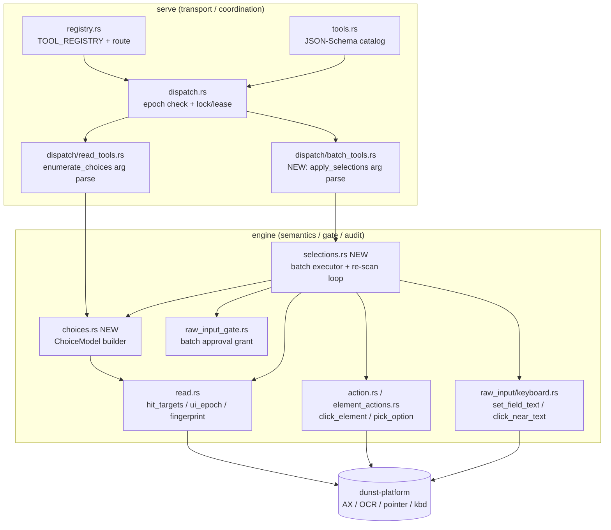
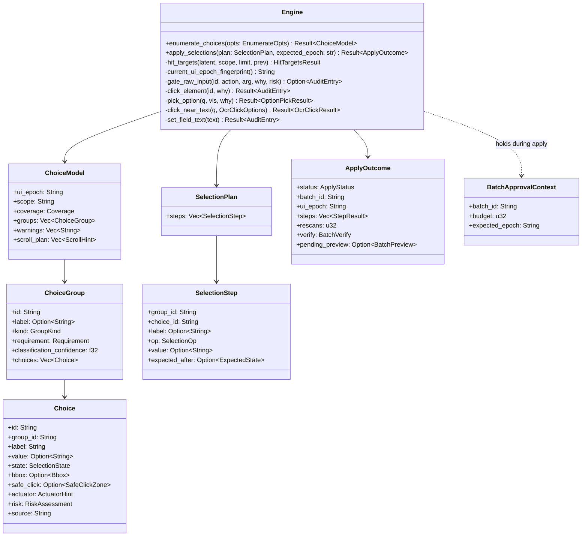
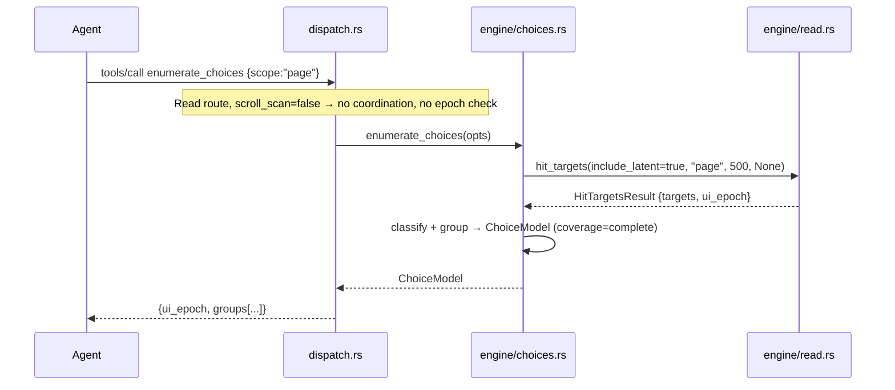
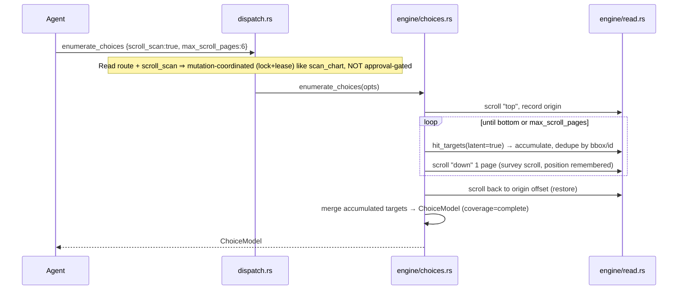
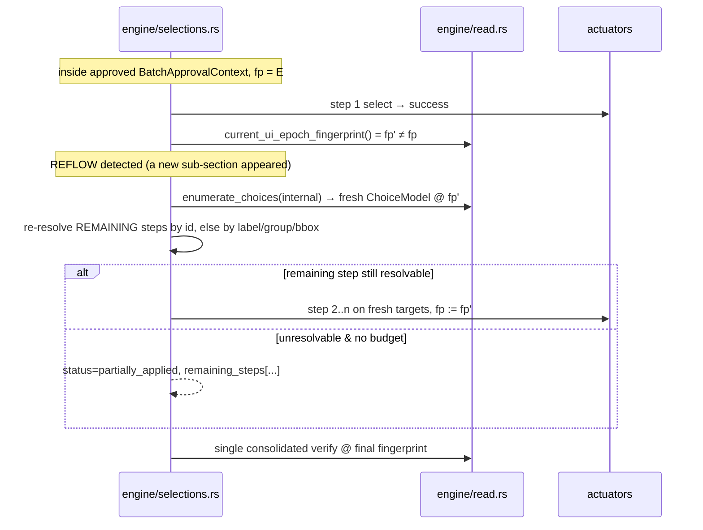
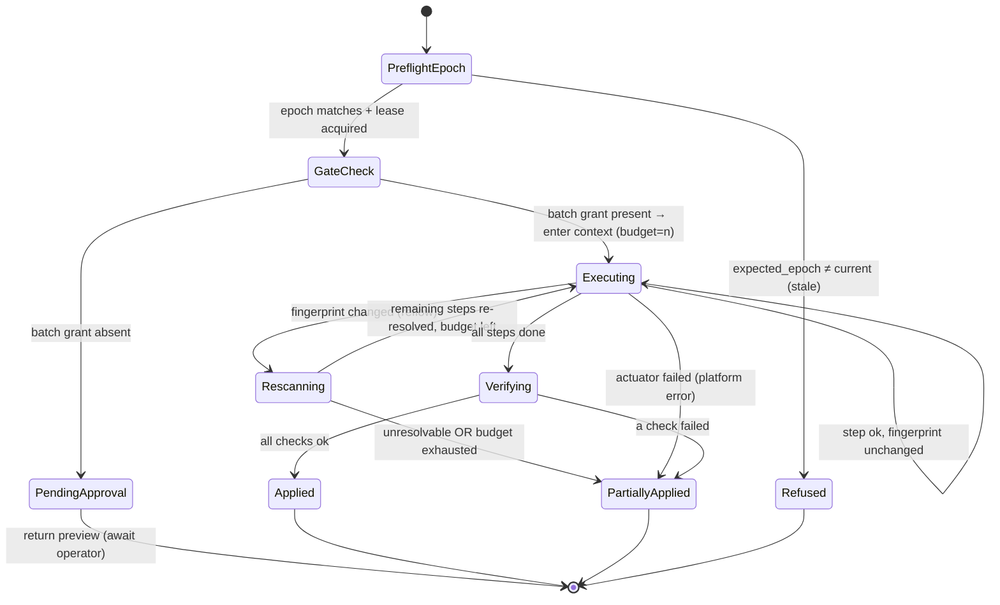

# Batch Choice Enumeration & Selection — Low-Level Design

> **Tier: L** (service with external deps — AX / OCR / vision / platform — multiple
> domain concepts, a batch-approval lifecycle, an epoch-guarded re-scan loop, and
> the existing per-session/window coordination path). Sections not needed by this
> component (DB schema, caching, migration) are omitted by design, not left as
> "N/A".

**Status:** proposed — implementable directly from this document.
**Crate:** `dunst-mcp` (engine + serve), with one read-only reuse of
`dunst-platform` actuators already wrapped by the engine.

---

## 1. Overview & HLD Anchor

**Parent HLD / architecture anchor:** `docs/ARCHITECTURE.md` (AX-first scene →
affordance graph → MCP projection) and `docs/CONTRACTS.md` (risk gate, approval
transport boundary, mutation coordination, UI-epoch staleness).

**Container(s) this LLD zooms into:** the `dunst-mcp` MCP server — specifically the
`serve` dispatch layer and the `engine` action/read layers. No new crate, no new
process, no new OS adapter.

**Problem.** Filling a multi-field modal or a scrollable choice page currently costs
one `perceive → approve → click → screenshot` round trip **per option**. A ~14-field
order is ≈70 MCP tool calls. Each raw mutating action re-gates, re-perceives, and is
verified individually.

**Goal.** Two new MCP primitives that collapse that loop:

| Primitive | Route | Mutates? | Approval |
|-----------|-------|----------|----------|
| `enumerate_choices` | Read | No (default); position-restoring scroll survey when `scroll_scan=true` | None |
| `apply_selections` | Mutating | Yes | **One** operator approval for the whole batch |

**Functional requirements covered:**

- **FR-1** `enumerate_choices` surveys the whole choice surface (off-screen AX in one
  shot, optionally a position-restoring scroll sweep for OCR-only surfaces) and
  returns a **structured option model**: groups with single-select vs multi-select
  semantics, required/optional, and per-choice `{id, label, coords, state}`.
- **FR-2** `apply_selections(plan, expected_epoch)` executes **all** picks as one
  batch behind a **single** operator approval.
- **FR-3** The batch refuses a stale plan up front (`expected_epoch` mismatch) and
  **re-scans only when `ui_epoch.fingerprint` changes mid-batch** (progressive
  disclosure / reflow), re-resolving the remaining steps against fresh targets.
- **FR-4** A **single consolidated verify** at the end replaces N per-click
  screenshots.
- **FR-5** Both primitives **reuse existing building blocks**: `get_hit_targets`
  (`Engine::hit_targets`), the `ui_epoch.fingerprint`, the `expected_epoch` stale
  refusal on the dispatch path, the raw/contextual approval gate, and the
  `click_near_text` / `click_element` / `pick_option` / `set_field_text` actuators.

**Non-goals.** No new perception backend (we consume `hit_targets` output verbatim).
No persistence. No change to how individual actuators talk to `dunst-platform`.

**Architecture style.** Same layered hexagon as the rest of `dunst-mcp`: `serve`
(transport + JSON schema + coordination) → `engine` (semantic logic + gate + audit)
→ `dunst-platform` (OS side effects, untouched here).

---

## 2. Component Architecture (C4 Level 3)



| Component | Responsibility | Depends on | Interface |
|-----------|----------------|-----------|-----------|
| `registry.rs` | Map the two new tool names to a route | — | `TOOL_REGISTRY` table |
| `tools.rs` | Advertise JSON Schemas for the two tools | `tool()`/`schema()` helpers | `tools_list()` |
| `dispatch.rs` | Pre-flight `expected_epoch` check + lock/lease for the mutating tool; survey-scroll coordination for the read tool | `CoordinationGuard`, `validate_expected_epoch` | `handle_tool_call` |
| `dispatch/batch_tools.rs` (new) | Parse `apply_selections` args → call engine | `args` helpers | `dispatch(engine, name, args)` |
| `engine/choices.rs` (new) | Build the `ChoiceModel` from `hit_targets` (classification + grouping) | `Engine::hit_targets` | `Engine::enumerate_choices(...)` |
| `engine/selections.rs` (new) | Batch executor: gate once, epoch-guarded re-scan loop, consolidated verify | choices.rs, gate, actuators | `Engine::apply_selections(...)` |
| `engine/raw_input_gate.rs` | Add a `batch@selections:*` synthetic approval target + grant | existing grant model | `approve_raw_input` / `consume_raw_approval` |

**Dependency direction rule.** Same as today: `serve → engine → platform`. The new
code adds nothing that points back up. `choices.rs` is pure projection over an
existing read result; `selections.rs` orchestrates existing actuators and never
talks to the OS directly.

---

## 3. Tactical Domain Model (the option model)

The whole feature hangs on one new value-object cluster: a normalized **choice
surface** projected from `HitTargetsResult`. This is tactical DDD — value objects and
one read-model aggregate (`ChoiceModel`). No entity has a persisted lifecycle.

| Type | Classification | Equality | Immutable? |
|------|----------------|----------|-----------|
| `ChoiceModel` | Read-model aggregate root | By value | Yes (snapshot) |
| `ChoiceGroup` | Value object | By value | Yes |
| `Choice` | Value object | By value (keyed by `id`) | Yes |
| `GroupKind` | Enum (`SingleSelect` / `MultiSelect` / `TextField` / `Action`) | By variant | Yes |
| `SelectionState` | Enum (`Selected` / `Unselected` / `Unknown`) | By variant | Yes |
| `Requirement` | Enum (`Required` / `Optional` / `Unknown`) | By variant | Yes |
| `SelectionPlan` | Value object (caller input) | By value | Yes |
| `SelectionStep` | Value object | By value | Yes |
| `BatchApprovalContext` | Transient engine state (not serialized) | — | No |

**Invariants the model protects:**

1. **Group/choice coherence.** Every `Choice.group_id` references a `ChoiceGroup.id`
   present in the same `ChoiceModel`. Ungrouped controls land in a synthetic
   `group_id = "ungrouped"`.
2. **Single-select cardinality.** In a `SingleSelect` group at most one `Choice` has
   `state = Selected` at snapshot time; the executor enforces "selecting X implies the
   previously selected sibling becomes Unselected" without a separate deselect step.
3. **Stable addressability.** `Choice.id` is the underlying `HitTarget.id` (AX node id,
   `ocr_text_*`, `shape_*`, or `page@scroll:*`). It is reused verbatim by
   `apply_selections` so a plan is addressable by id, with `label` + `bbox` carried as
   re-resolution fallbacks after reflow.
4. **Epoch binding.** A `ChoiceModel` always carries the `ui_epoch.fingerprint` it was
   built from; a plan built from it is only valid while that fingerprint holds (the
   dispatch pre-flight) and is re-pinned on each mid-batch re-scan.

**Classification heuristics (best-effort, confidence-scored).** Derived from the
already-computed `HitTarget` fields (`role`, `action_modes[].action`, `label`,
`value`, `source`):

| Signal | Inferred `GroupKind` / state |
|--------|------------------------------|
| `role == "radio"` / `action == Pick` on radio cluster | `SingleSelect` |
| `role == "checkbox"` or `"switch"`, `action == Toggle` | `MultiSelect` |
| `role` in `{"popup_button","combobox","menu_button"}`, `action == Pick`/`OpenMenu` | `SingleSelect` (popover) |
| `role` in `{"text_field","text_area","search_field"}`, `action == Type` | `TextField` |
| `role == "button"` with `action == Click` and no select semantics | `Action` (e.g. submit; excluded from auto-select) |
| `value` is truthy (`"1"`, `"true"`, AX `AXValue==1`) | `SelectionState::Selected` |
| `label`/sibling label contains `*`, `required`, `obligatoire`, `requis` | `Requirement::Required` |

Grouping uses, in priority order: (a) shared AX container/parent id when available
from the scene graph, (b) shared `role` + horizontal/vertical proximity band (radios
in a column), (c) a shared label prefix. Each `ChoiceGroup` carries a
`classification_confidence` in `[0,1]` so the agent (and tests) can treat low-confidence
groups as advisory.

---

## 4. Class / Module Design



**Enums**

```rust
pub enum GroupKind { SingleSelect, MultiSelect, TextField, Action }
pub enum SelectionState { Selected, Unselected, Unknown }
pub enum Requirement { Required, Optional, Unknown }
pub enum Coverage { Complete, Partial }            // Partial => scroll_plan non-empty
pub enum ActuatorHint { ClickElement, PickOption, ClickNearText, SetFieldText, Scroll }
pub enum SelectionOp { Select, Deselect, SetText }
pub enum ApplyStatus { PendingApproval, Applied, PartiallyApplied, Refused }
```

**New engine entry points** (signatures, `crates/dunst-mcp/src/engine/`):

```rust
// engine/choices.rs
pub struct EnumerateOpts<'a> {
    pub scope: &'a str,        // "page" (default) | "all" | "browser_chrome"
    pub include_latent: bool,  // default true — capture off-screen AX choices in one shot
    pub scroll_scan: bool,     // default false — position-restoring OCR sweep
    pub max_scroll_pages: usize, // clamp 1..=12 (default 6)
    pub limit: usize,          // max choices, clamp 1..=500 (default 200)
}
impl Engine {
    pub fn enumerate_choices(&mut self, opts: EnumerateOpts) -> dunst_core::Result<ChoiceModel>;
}

// engine/selections.rs
impl Engine {
    pub fn apply_selections(
        &mut self,
        plan: SelectionPlan,
        expected_epoch: &str,
    ) -> dunst_core::Result<ApplyOutcome>;
}
```

**Patterns used (documented because non-obvious):**

| Pattern | Where | Why |
|---------|-------|-----|
| Read-model / Projection | `ChoiceModel` over `HitTargetsResult` | Keep perception in one place; choices.rs only re-shapes, never re-perceives |
| Strategy (`ActuatorHint`) | step → actuator dispatch in selections.rs | One executor, swappable per-choice actuator without branching logic leaking into callers |
| Unit-of-Work / batch context | `BatchApprovalContext` | One approval authorizes the whole unit; cleared on completion (SRP for "am I inside an approved batch?") |
| Guarded retry loop | epoch-guarded re-scan | Re-resolve remaining steps only when the fingerprint moves |

**SOLID notes.** `enumerate_choices` is pure projection (SRP, no side effects in the
default path). `apply_selections` depends on the actuators through the existing
`Engine` methods (already the DI seam used by every other tool), so the executor is
testable against a mock platform exactly like `act` is today.

---

## 5. API Contracts (MCP tools)

Both tools are added to `tools_list()` in `crates/dunst-mcp/src/serve/tools.rs` using
the existing `tool(name, description, schema(props, required))` helpers, and to
`TOOL_REGISTRY` in `registry.rs`.

### 5.1 `enumerate_choices`

**Route:** `ToolRoute::Read`. **Mutates:** only when `scroll_scan=true` (then it is
mutation-coordinated like `scan_chart`/`read_at borrow_cursor`, but **not**
operator-approval-gated — see ADR-1).

**Input schema** (catalog form):

```rust
tool(
    "enumerate_choices",
    "Survey the whole choice surface once and return a structured option model: \
     groups (single-select vs multi-select vs text field), required/optional, and \
     per-choice {id, label, coords, current state}. Default mode captures off-screen \
     AX choices in a single pass (no scroll). scroll_scan=true performs a \
     position-restoring scroll sweep to also assemble OCR/vision choices on \
     virtualized or AX-sparse surfaces; it surveys without operator approval and \
     restores the original scroll position. Pass the returned ui_epoch to \
     apply_selections as expected_epoch.",
    schema(
        json!({
            "scope": { "type": "string", "enum": ["page", "all", "browser_chrome"], "description": "target surface (default page)" },
            "include_latent": { "type": "boolean", "description": "include off-screen AX choices (default true)" },
            "scroll_scan": { "type": "boolean", "description": "position-restoring scroll sweep for OCR-only surfaces (default false)" },
            "max_scroll_pages": { "type": "integer", "description": "scroll-sweep bound, 1-12 (default 6)" },
            "limit": { "type": "integer", "description": "max choices, 1-500 (default 200)" },
            "fresh": { "type": "boolean", "description": "ensure a recent graph first (default true)" },
            "force_refresh": { "type": "boolean", "description": "force AX refresh even inside the short TTL (default false)" }
        }),
        &[],
    ),
)
```

**Result body** (`content[0].text` is the JSON below; `_meta.dunst` envelope as
usual):

```json
{
  "ui_epoch": "a1b2c3d4e5f60718",
  "scope": "page",
  "coverage": "complete",
  "groups": [
    {
      "id": "grp_delivery_time",
      "label": "Delivery time",
      "kind": "single_select",
      "requirement": "required",
      "classification_confidence": 0.92,
      "choices": [
        { "id": "AXRadioButton_17", "group_id": "grp_delivery_time", "label": "ASAP",
          "value": "1", "state": "selected", "bbox": {"x":120,"y":340,"w":80,"h":24},
          "safe_click": {"center":[160,352]}, "actuator": "click_element",
          "risk": {"level":"low","requires_approval":false,"reasons":[]}, "source": "ax" },
        { "id": "AXRadioButton_18", "label": "Schedule", "state": "unselected",
          "actuator": "click_element", "source": "ax", "risk": {"level":"low","requires_approval":false} }
      ]
    },
    {
      "id": "grp_extras",
      "label": "Extras",
      "kind": "multi_select",
      "requirement": "optional",
      "classification_confidence": 0.80,
      "choices": [
        { "id": "AXCheckBox_3", "label": "Cutlery", "state": "unselected", "actuator": "click_element", "source": "ax" },
        { "id": "AXCheckBox_4", "label": "Napkins", "state": "selected", "actuator": "click_element", "source": "ax" }
      ]
    },
    {
      "id": "grp_note",
      "label": "Note to courier",
      "kind": "text_field",
      "requirement": "optional",
      "choices": [
        { "id": "AXTextArea_9", "label": "Note to courier", "value": "", "state": "unknown", "actuator": "set_field_text", "source": "ax" }
      ]
    }
  ],
  "warnings": [],
  "scroll_plan": []
}
```

When `coverage = "partial"`, `scroll_plan` is non-empty (the `page@scroll:*`
pseudo-targets from `hit_targets`) and instructs the caller to scroll + re-enumerate
to complete the model.

### 5.2 `apply_selections`

**Route:** new `ToolRoute::Batch` (or reuse `Element`; see §Integration). **Mutates:**
yes — added to `tool_requires_mutation_coordination` and (for `fencing_token`)
`tool_accepts_mutation_preconditions`.

**Input schema:**

```rust
tool(
    "apply_selections",
    "Apply a whole choice plan as ONE batch behind a single operator approval. \
     Build the plan from enumerate_choices and pass that ui_epoch as expected_epoch. \
     The batch refuses a stale plan up front, re-scans ONLY when the UI epoch \
     fingerprint changes mid-batch (progressive disclosure / reflow) and re-resolves \
     the remaining steps, then runs a single consolidated verify. First call returns \
     status=pending_approval with a per-step preview incl. risk; an operator approves \
     the returned batch_id once, then re-call with the same plan to execute.",
    schema(
        json!({
            "expected_epoch": { "type": "string", "description": "ui_epoch.fingerprint the plan was built from (required)" },
            "plan": {
                "type": "object",
                "properties": {
                    "steps": {
                        "type": "array",
                        "items": {
                            "type": "object",
                            "properties": {
                                "group_id":  { "type": "string" },
                                "choice_id": { "type": "string", "description": "Choice.id from enumerate_choices" },
                                "label":     { "type": "string", "description": "re-resolution fallback after reflow" },
                                "op":        { "type": "string", "enum": ["select", "deselect", "set_text"] },
                                "value":     { "type": "string", "description": "text for set_text" },
                                "expected_after": {
                                    "type": "object",
                                    "properties": {
                                        "state": { "type": "string", "enum": ["selected", "unselected"] },
                                        "value": { "type": "string" }
                                    }
                                }
                            },
                            "required": ["choice_id", "op"]
                        }
                    }
                },
                "required": ["steps"]
            },
            "include_diff": { "type": "boolean" }
        }),
        &["expected_epoch", "plan"],
    ),
)
```

**Result body — pending approval (first call):**

```json
{
  "status": "pending_approval",
  "batch_id": "batch@selections:9f2c41ab77de0033:5",
  "approval_hint": "operator must run approve(batch_id); approve authorizes the whole batch once",
  "max_risk": "low",
  "preview": [
    { "choice_id": "AXRadioButton_18", "op": "select",  "label": "Schedule", "risk": "low" },
    { "choice_id": "AXCheckBox_3",     "op": "select",  "label": "Cutlery",  "risk": "low" },
    { "choice_id": "AXTextArea_9",     "op": "set_text","label": "Note to courier", "risk": "low" }
  ]
}
```

**Result body — applied (re-call after approval):**

```json
{
  "status": "applied",
  "batch_id": "batch@selections:9f2c41ab77de0033:5",
  "ui_epoch": "77de0033a1b2c3d4",
  "rescans": 1,
  "steps": [
    { "choice_id": "AXRadioButton_18", "op": "select",  "result": "success", "resolved_by": "id" },
    { "choice_id": "AXCheckBox_3",     "op": "select",  "result": "success", "resolved_by": "id" },
    { "choice_id": "AXTextArea_9",     "op": "set_text","result": "success", "resolved_by": "label_after_rescan" }
  ],
  "verify": {
    "ok": true,
    "checks": [
      { "choice_id": "AXRadioButton_18", "expected": "selected", "actual": "selected", "ok": true },
      { "choice_id": "AXCheckBox_3",     "expected": "selected", "actual": "selected", "ok": true },
      { "choice_id": "AXTextArea_9",     "expected_value": "leave at door", "actual_value": "leave at door", "ok": true }
    ]
  }
}
```

**Error responses** (tool returns `isError: true` with a text message; structured
machine codes inside the JSON where the caller must branch):

| Condition | `status` / message | Caller action |
|-----------|--------------------|---------------|
| `expected_epoch` mismatch at pre-flight | dispatch returns `"stale UI epoch: … call get_hit_targets again before mutating"` + `_meta.dunst.coordination.epoch.status="stale"` | Re-run `enumerate_choices`, rebuild plan, retry |
| Plan references an unknown `choice_id` and label re-resolution fails | `status: "refused"`, `reason: "unresolvable_step"` | Re-enumerate |
| Operator approval missing | `status: "pending_approval"` (not an error) | Approve `batch_id`, re-call |
| Batch budget exhausted (too many reflows) | `status: "partially_applied"`, `remaining_steps: [...]` | Re-enumerate + apply remaining |
| A constituent actuator fails (platform error) | `status: "partially_applied"`, the failed step `result:"failed"` | Inspect, retry remaining |
| `DUNST_MCP_ENABLE_APPROVE_TOOL` unset | `pending_approval` returned but no `approve` tool advertised | Operator enables flag for the session |

---

## 6. Sequence Diagrams (critical flows)

### 6.1 `enumerate_choices` — AX-latent survey (default, no scroll, no gate)



### 6.2 `enumerate_choices` — scroll-scan survey (OCR-only / virtualized surface)



### 6.3 `apply_selections` — happy path (single approval, no reflow)

```mermaid
sequenceDiagram
    participant Agent
    participant Op as Operator
    participant Disp as dispatch.rs
    participant Eng as engine/selections.rs
    participant Gate as raw_input_gate.rs
    participant Act as actuators

    Agent->>Disp: apply_selections {expected_epoch:E, plan}
    Disp->>Disp: validate_expected_epoch(E) == current → OK
    Disp->>Disp: CoordinationGuard.acquire (lock + window lease)
    Disp->>Eng: apply_selections(plan, E)
    Eng->>Gate: batch_id = batch@selections:<hash>:<n>; approved?
    Gate-->>Eng: not approved → PendingApproval (1 audit entry)
    Eng-->>Agent: status=pending_approval, batch_id, preview[risk]
    Agent->>Op: surface preview
    Op->>Disp: approve(batch_id)
    Disp->>Gate: approve_raw_input(batch_id) → grant budget=n
    Agent->>Disp: apply_selections {expected_epoch:E, plan}  (re-call)
    Disp->>Eng: apply_selections(plan, E)
    Eng->>Gate: consume batch grant → enter BatchApprovalContext{budget=n}
    loop each step
        Eng->>Act: actuator(step) under batch context (no per-step operator prompt)
        Act-->>Eng: AuditEntry success
        Eng->>Eng: fingerprint unchanged → continue
    end
    Eng->>Eng: consolidated verify: hit_targets once, compare expected_after
    Eng-->>Agent: status=applied, steps[], verify{ok:true}, ui_epoch
```

### 6.4 `apply_selections` — mid-batch reflow (progressive disclosure)



### 6.5 `apply_selections` — stale plan refusal (pre-flight)

```mermaid
sequenceDiagram
    participant Agent
    participant Disp as dispatch.rs
    Agent->>Disp: apply_selections {expected_epoch:OLD, plan}
    Disp->>Disp: refresh_if_stale(); current = fp_now ≠ OLD
    Disp-->>Agent: isError "stale UI epoch …" + _meta.dunst.coordination.epoch{status:"stale", current_epoch}
    Note over Agent: re-run enumerate_choices, rebuild plan, retry
```

---

## 7. State Machine — batch approval & epoch-guarded execution



**Transition table (guards + side effects):**

| From | To | Trigger | Guard | Side effects |
|------|----|---------|-------|--------------|
| PreflightEpoch | Refused | epoch mismatch | `current ≠ expected_epoch` | Return stale message + epoch meta (no mutation) |
| GateCheck | PendingApproval | first call | batch grant not present | One `PendingApproval` audit entry; return preview incl. per-step risk + `max_risk` |
| GateCheck | Executing | re-call after approve | batch grant present (TTL valid) | Consume grant; set `BatchApprovalContext{budget=n}` |
| Executing | Rescanning | after a step | `current_ui_epoch_fingerprint() ≠ pinned fp` | Internal `enumerate_choices`; re-pin fp |
| Rescanning | Executing | re-resolution ok | step found by id or label/group/bbox & budget>0 | Continue from next unfinished step |
| Executing | Verifying | last step done | — | Single `hit_targets` read |
| Verifying | Applied | all `expected_after` hold | — | Clear `BatchApprovalContext`; consume batch grant (one-shot) |
| any | PartiallyApplied | failure/exhaustion | budget==0 or actuator Err or check fail | Clear context; return `remaining_steps` |

**Budget.** `budget = plan.steps.len()` at entry, capped at `MAX_BATCH_PICKS = 64`.
Each executed actuator consumes one unit. A reflow re-resolution that re-executes an
already-attempted step also consumes a unit — so a plan that thrashes the UI runs out
of budget and degrades to `partially_applied` rather than looping. `MAX_RESCANS = 8`
bounds the re-scan loop independently.

---

## 8. Error Handling & Resilience

**Error taxonomy:**

| Category | Examples | Strategy |
|----------|----------|----------|
| Stale plan (pre-flight) | `expected_epoch` ≠ current | Refuse before any mutation; reuse `validate_expected_epoch`; caller re-enumerates |
| Reflow (recoverable) | progressive disclosure reveals new fields | Re-scan + re-resolve remaining steps, bounded by `MAX_RESCANS` and budget |
| Unresolvable step | `choice_id` gone, label match ambiguous/absent | Mark step `failed:"unresolvable"`, continue others, return `partially_applied` |
| Approval missing | operator hasn't approved | Return `pending_approval` (not an error); idempotent on re-call with same plan hash |
| Actuator/platform failure | AX write failed, user-active guard block | Existing `audit_raw_input` semantics: failed step is audited; `user-active` block restores budget for that step and surfaces a retry hint |
| Coordination conflict | another session holds the window lease, stale `fencing_token` | Reuse `CoordinationGuard` refusal (already tested) |
| Budget/loop exhaustion | UI thrash | `partially_applied` with `remaining_steps`, never an infinite loop |

**Idempotency.** `batch_id = batch@selections:<fnv64(plan)>:<n_steps>`. The same plan
yields the same `batch_id`, so a re-call after the operator approves consumes the
existing grant; a *different* plan produces a *different* id and re-gates. A
already-`selected` choice targeted by `op:select` is a no-op verified as success (the
executor checks current state before acting).

**No partial-approval leakage.** The batch grant is one-shot (CONTRACTS: "approvals
are validated; element/contextual approvals are one-shot"): a second `apply_selections`
re-gates. The `BatchApprovalContext` is always cleared on exit (success, partial, or
error) so a later single pick is never silently authorized.

---

## 9. Concurrency Design

This component runs inside the existing single-threaded MCP dispatch, but it touches
the cross-session coordination state and the per-engine approval maps.

| Shared resource | Access pattern | Mechanism | Rationale |
|-----------------|----------------|-----------|-----------|
| Global mutation lock + window lease | one writer at a time | existing `CoordinationGuard::acquire` (lock + TTL lease + fencing token) | A batch must not interleave with another session's mutation on the same window |
| `Engine.raw_approvals` / `raw_approval_inflight` | single-threaded mutate | existing maps; add `batch@selections:*` scope | Reuse the proven event-budget/TTL grant model |
| `BatchApprovalContext` | set at entry, cleared at exit | `Option<BatchApprovalContext>` field on `Engine` | Bounds the "inside an approved batch" window to exactly one `apply_selections` call |
| Scroll position (survey) | borrow + restore | record origin offset, restore after sweep | Survey must leave the surface where it found it |

**Race mitigations.** The dispatch-level `expected_epoch` check + the window lease
together ensure the surface did not change between enumerate and apply (or the apply is
refused). Mid-batch, the fingerprint re-check is the optimistic-concurrency token: any
unexpected reflow forces a re-scan instead of acting on stale coordinates.

---

## 10. Component-Level Security (STRIDE)

| Threat | Vector | Mitigation |
|--------|--------|-----------|
| **Spoofing** approval | Agent forges a `batch_id` and "self-approves" | `approve` stays operator-only behind `DUNST_MCP_ENABLE_APPROVE_TOOL`; `validate_synthetic_raw_approval` must accept `batch@selections:` only when structurally valid (hex64 hash + positive count); a fabricated id is rejected exactly like other synthetic targets |
| **Tampering** with coords | Stale/forged `bbox` clicks the wrong control | Picks resolve by `choice_id` first; coordinate fallback only via `click_near_text` (OCR-verified) or `safe_click` zones; off-target points already refused by `ensure_point_in_target_window` |
| **Repudiation** | Batch hides which actions ran | Every constituent actuator still appends its own `AuditEntry` (CONTRACTS: "every attempt is audited"); plus one batch `PendingApproval` entry and `ApplyOutcome.steps[]` |
| **Information disclosure** | Preview leaks field contents | Preview surfaces labels + risk, not field values; `set_text` values are caller-supplied, never echoed from the screen |
| **Denial of service** | UI-thrash infinite re-scan | `MAX_RESCANS`, `MAX_BATCH_PICKS` budget, scroll-sweep `max_scroll_pages` clamp |
| **Elevation of privilege** | Low-risk batch sneaks a high-risk pick past the operator | Pending-approval preview MUST include per-step `risk` and an aggregate `max_risk`; the single approval is therefore informed, and the high-risk step is visible before approval |

**Input validation rules.** `plan.steps` non-empty and ≤ `MAX_BATCH_PICKS`; each step
`op ∈ {select,deselect,set_text}`; `set_text` requires `value`; `choice_id`
non-empty. `expected_epoch` required and non-empty. Reject the whole call on schema
violation before gating.

---

## 11. Testability Design

**DI / mock boundaries.** The executor depends only on `Engine` methods that already
run against the mock platform in `engine/tests/*` (the same seam `act` uses). No new
external dependency is introduced, so the full feature is unit-testable headless
(off-macOS, where `set_field_text` returns the documented stub error and AX-latent
classification still runs on a mock scene graph).

| Layer | What to mock | Test style |
|-------|--------------|-----------|
| `choices.rs` classification | mock `SceneGraph` + `AffordanceGraph` (existing `engine_with_window` / fixtures) | Pure assertion on the produced `ChoiceModel` |
| `selections.rs` executor | mock actuators via the existing executor trait | State-machine assertions (gate → approve → apply → verify) |
| `serve` catalog | `tools_list()` | Schema shape + count |
| `serve` dispatch | `call(&mut e, "apply_selections", json!{...})` | Stale-epoch + coordination refusals |

**Unit tests to add** (names mirror the CONTRACTS convention):

- `engine::tests::enumerate_classifies_radios_as_single_select_and_checkboxes_as_multi`
- `engine::tests::enumerate_marks_required_group_from_label_markers`
- `engine::tests::enumerate_ax_latent_captures_offscreen_choices_without_scroll`
- `engine::tests::enumerate_scroll_scan_restores_origin_and_sets_coverage_complete`
- `engine::tests::enumerate_partial_coverage_returns_scroll_plan`
- `engine::tests::apply_selections_first_call_is_pending_with_per_step_risk_preview`
- `engine::tests::apply_selections_single_approval_executes_whole_batch`
- `engine::tests::apply_selections_batch_grant_is_one_shot_resists_second_batch`
- `engine::tests::apply_selections_rescans_only_when_fingerprint_changes`
- `engine::tests::apply_selections_reflow_reresolves_remaining_steps_by_label`
- `engine::tests::apply_selections_budget_exhaustion_degrades_to_partial`
- `engine::tests::apply_selections_single_consolidated_verify_reports_per_check`
- `engine::tests::apply_selections_rejects_forged_batch_id_via_validate_synthetic`
- `serve::tests::stale_expected_epoch_refuses_apply_selections` (mirror existing
  `mutating_tool_rejects_stale_expected_epoch`)
- `serve::tests::tools_list_exposes_enumerate_choices_and_apply_selections`
- Update `serve::tests::catalog::tools_list_exposes_read_text_with_object_schema`:
  bump `assert_eq!(tools.len(), 70)` → `72`, and
  `tool_registry_matches_advertised_catalog` accordingly.

**Testability score:** new external dependencies = 0 (100% reuse of injected seams).

---

## 12. Configuration & Feature Flags

| Flag | Effect | Default |
|------|--------|---------|
| `DUNST_MCP_ENABLE_APPROVE_TOOL` | (existing) advertises/executes `approve`, including `batch@selections:*` | unset (operator opt-in) |
| `MAX_BATCH_PICKS` (const) | hard cap on plan length / budget | 64 |
| `MAX_RESCANS` (const) | bound on mid-batch re-scan loop | 8 |
| `BATCH_APPROVAL_TTL_SECS` (const, reuse `RAW_APPROVAL_TTL_SECS`) | grant lifetime | 120 |
| `enumerate_choices.max_scroll_pages` (arg) | survey-sweep bound | 6 (clamp 1..=12) |

No new env var is required for the common path: `enumerate_choices` and the
`pending_approval` response work without any flag; only the operator's `approve` step
needs the existing flag, exactly like every other gated mutation today.

---

## 13. Micro-ADRs

**ADR-1 — Survey scroll is coordinated but not operator-approval-gated.**
*Context:* `enumerate_choices(scroll_scan=true)` must scroll to assemble OCR-only
choices, yet scrolling is normally raw-approval-gated. *Decision:* model survey scroll
on `scan_chart`/`read_at(borrow_cursor)` — it acquires the mutation lock + lease (so it
serializes against other sessions) but does **not** require operator approval, and it
**restores the original scroll position**. *Rationale:* surveying does not mutate
application data; gating a read would reintroduce the per-step approval cost the feature
exists to remove. *Consequence:* if the project later decides scroll itself is
operator-worthy, `enumerate_choices` must inherit that gate; flagged here so the
decision is explicit. *Alternative rejected:* AX-latent-only enumeration (no scroll) —
kept as the default mode, but insufficient for virtualized/AX-sparse lists.

**ADR-2 — One approval = a bounded batch context, not a per-pick budget alone.**
*Decision:* the operator approves a single `batch_id`; the engine then runs inside a
`BatchApprovalContext` with a numeric budget (= step count, capped). *Rationale:* a
single context is simpler to reason about across a mid-batch re-scan than tracking
heterogeneous per-pick grants, while the budget still bounds blast radius. *Reuse:* the
grant itself lives in the existing `raw_approvals` map with the existing TTL, so
`attach`/expiry/exhaustion clearing is inherited for free (mirrors the scroll-grant
precedent that already lets one approval cover 8 scroll events). *Alternative rejected:*
auto-approving each constituent element gate individually — would either re-prompt or
silently widen authorization.

**ADR-3 — Plan addresses choices by id, with label/group/bbox re-resolution.**
*Decision:* `SelectionStep.choice_id` is the `HitTarget.id`; on reflow the executor
re-resolves remaining steps by id, then by `(group_id, label)`, then by nearest `bbox`.
*Rationale:* ids are stable within an epoch (CONTRACTS: WP-D stable ids) and free to
carry; labels/bbox survive id churn after a reflow. *Consequence:* a step that matches
neither is reported `unresolvable` rather than guessing — fail-closed.

**ADR-4 — Reuse `expected_epoch` for pre-flight, `fingerprint` re-check for in-flight.**
*Decision:* the dispatch-level `validate_expected_epoch` guards the plan↔surface gap
*before* execution; `current_ui_epoch_fingerprint()` guards reflow *during* execution.
*Rationale:* two distinct staleness moments; reusing the same fingerprint primitive for
both keeps one source of truth and zero new perception code.

---

## 14. Integration Points (exact edits)

| File | Edit |
|------|------|
| `crates/dunst-mcp/src/engine/choices.rs` | **new** — `EnumerateOpts`, `ChoiceModel` + value objects, `Engine::enumerate_choices`, classification/grouping helpers |
| `crates/dunst-mcp/src/engine/selections.rs` | **new** — `SelectionPlan`/`SelectionStep`/`ApplyOutcome`, `BatchApprovalContext`, `Engine::apply_selections`, epoch-guarded loop, consolidated verify |
| `crates/dunst-mcp/src/engine.rs` | declare `mod choices; mod selections;`; add `active_batch: Option<BatchApprovalContext>` field (init `None`) |
| `crates/dunst-mcp/src/engine/raw_input_gate.rs` | add `raw_apply_selections_target_id(hash, n)`; extend `is_synthetic_approval_target_id` with `batch@`; add a `batch@selections:` arm to `validate_synthetic_raw_approval` and a `raw_approval_policy` entry (grant=n, cost=1) |
| `crates/dunst-mcp/src/serve/registry.rs` | add `tool("enumerate_choices", ToolRoute::Read)` and `tool("apply_selections", ToolRoute::Batch)` (or `::Element`) |
| `crates/dunst-mcp/src/serve/dispatch.rs` | route `apply_selections`; add it to `tool_requires_mutation_coordination`; make `tool_requires_mutation_coordination(Read, "enumerate_choices", args)` return `arg_bool(args,"scroll_scan")` |
| `crates/dunst-mcp/src/serve/dispatch/read_tools.rs` | parse + call `enumerate_choices` |
| `crates/dunst-mcp/src/serve/dispatch/batch_tools.rs` | **new** — parse + call `apply_selections` (or fold into `element_tools.rs`) |
| `crates/dunst-mcp/src/serve.rs` | add `apply_selections` to `tool_accepts_mutation_preconditions` (for `fencing_token`); add `mod batch_tools;` wiring if a new route is used |
| `crates/dunst-mcp/src/serve/tools.rs` | add the two `tool(...)` catalog entries (§5) |
| `crates/dunst-mcp/src/serve/tests/catalog.rs` | bump tool count `70 → 72`; add presence assertions |
| `docs/CONTRACTS.md` | add the three invariants in §15 |
| `docs/AGENT_GUIDE.md` | add a "Batch a multi-field choice page" recipe |

**Reuse map (no reimplementation):**

| Need | Existing building block |
|------|-------------------------|
| Enumerate targets + epoch | `Engine::hit_targets(include_latent, scope, limit, prev)` → `HitTargetsResult{targets, ui_epoch}` |
| Per-choice action + risk | `HitTarget.action_modes[].{action, tool_hint, risk}`, `HitTarget.safe_click` |
| Reflow fingerprint | `Engine::current_ui_epoch_fingerprint()` / `ui_fingerprint()` |
| Pre-flight stale refusal | `dispatch::validate_expected_epoch` |
| Single approval primitive | `Engine::gate_raw_input` + `approve_raw_input`/`consume_raw_approval` grant model |
| Pick actuators | `click_element`, `pick_option`, `click_near_text`, `set_field_text`, `type_into`, `scroll` |
| Lock / lease / fencing | `serve::coordination::CoordinationGuard` |

---

## 15. CONTRACTS.md additions

Append under "Risk gate":

- **Batch selections are approved as one unit.** `apply_selections` records exactly one
  `PendingApproval` for a `batch@selections:<hash>:<n>` target whose preview carries
  per-step risk and an aggregate `max_risk`; a single operator `approve(batch_id)`
  authorizes the whole batch, the grant is one-shot, and the `BatchApprovalContext` is
  always cleared on exit so no later single action is silently authorized.
  — `engine::tests::apply_selections_first_call_is_pending_with_per_step_risk_preview`,
  `engine::tests::apply_selections_batch_grant_is_one_shot_resists_second_batch`.
- **Batch execution is epoch-guarded.** `apply_selections` refuses a plan whose
  `expected_epoch` no longer matches (pre-flight) and re-scans **only** when the UI
  fingerprint changes mid-batch, re-resolving remaining steps by id then label/bbox;
  bounded by `MAX_RESCANS` and the step budget.
  — `engine::tests::apply_selections_rescans_only_when_fingerprint_changes`,
  `serve::tests::stale_expected_epoch_refuses_apply_selections`.
- **Enumeration is read-only or survey-only.** `enumerate_choices` mutates no
  application state: default mode does not scroll; `scroll_scan` restores the original
  scroll position and is mutation-coordinated but not operator-approval-gated.
  — `engine::tests::enumerate_scroll_scan_restores_origin_and_sets_coverage_complete`.

---

## 16. Test Plan

**Pyramid.**

| Level | Coverage | Where |
|-------|----------|-------|
| Unit (headless, mock platform) | classification, grouping, requirement inference, plan resolution, state machine, budget/loop bounds, forged-id rejection | `engine/tests/*` (new `choices`/`selections` test modules) |
| Contract | catalog count/shape, dispatch epoch + coordination refusals, approval transport | `serve/tests/*` |
| Integration (macOS, gated) | real AX modal + OCR-only list end-to-end, reflow on a progressive-disclosure form | manual rig / `docs/fixtures/mcp-transcript.jsonl` style capture |

**Key scenarios (Gherkin-ish):**

1. *Single-select + multi-select + text* — enumerate a 14-field order modal; assert the
   `ChoiceModel` shape; build a 14-step plan; one approval; `status=applied`, verify
   all 14 with one consolidated read; **≤ 4 tool calls total** (enumerate, apply→pending,
   approve, apply→applied) vs ≈70 today.
2. *Reflow* — selecting "Schedule" reveals a time picker; assert exactly one re-scan,
   `rescans=1`, the picker step re-resolved, single verify.
3. *Stale plan* — mutate the surface between enumerate and apply; assert pre-flight
   refusal with `epoch.status="stale"` and no mutation.
4. *Partial* — feed an unresolvable `choice_id`; assert `partially_applied` +
   `remaining_steps`, other steps still applied.
5. *Approval boundary* — with `DUNST_MCP_ENABLE_APPROVE_TOOL` unset, assert
   `pending_approval` returned and no `approve` tool advertised; with it set, the batch
   completes.
6. *DoS bound* — a thrashing surface (fingerprint flips every step) hits `MAX_RESCANS`
   and degrades to `partially_applied`, never loops.

**Negative/NFR:** off-target coordinates rejected; budget cap enforced; survey scroll
position restored; one `AuditEntry` per constituent action (audit completeness).

---

## DCI-LLD Score

| # | Item | Weight | Score | Note |
|---|------|--------|-------|------|
| 1 | Component architecture (C4 L3) | 5 | 1.0 | Layers + dependency direction + exact files |
| 2 | API contracts | 5 | 1.0 | Both tool schemas, result/error bodies, status codes |
| 3 | Database schema | 0 | — | No persistence (omitted by mitosis) |
| 4 | Sequence diagrams | 4 | 1.0 | Enumerate ×2, apply happy/reflow/stale |
| 5 | Class/module design | 4 | 1.0 | Signatures, value objects, patterns justified |
| 6 | Error handling | 4 | 1.0 | Taxonomy + idempotency + no-leak |
| 7 | State machine | 3 | 1.0 | Batch lifecycle + guards/side effects table |
| 8 | Security (STRIDE) | 3 | 1.0 | Component-level, with input validation rules |
| 9 | Testability | 3 | 1.0 | DI seam, named tests, 0 new deps |
| 10 | Domain model | 3 | 1.0 | Value objects, invariants, classification table |
| 11 | Concurrency | 2 | 1.0 | Lock/lease reuse + optimistic fingerprint token |
| 12 | Migration plan | 0 | — | Additive feature (omitted) |

**DCI-LLD = Σ(wᵢ·sᵢ)/Σwᵢ × 10 = 36/36 × 10 = 10.0 → Excellent** (implementable
without further questions). Derived: Contract Coverage 100% (2/2 new tools specified);
Testability 100% (0 new external deps); Implementation Ambiguity < 10% (open choices
are explicit ADRs, not gaps).

---

### Handoff suggestions

- Run `/cli-audit-drift` after implementation to bootstrap the three new CONTRACTS
  invariants into the drift baseline.
- Run `/cli-audit-code` on `engine/selections.rs` once written — the batch executor is
  the highest-risk new surface (gate + loop + budget).
