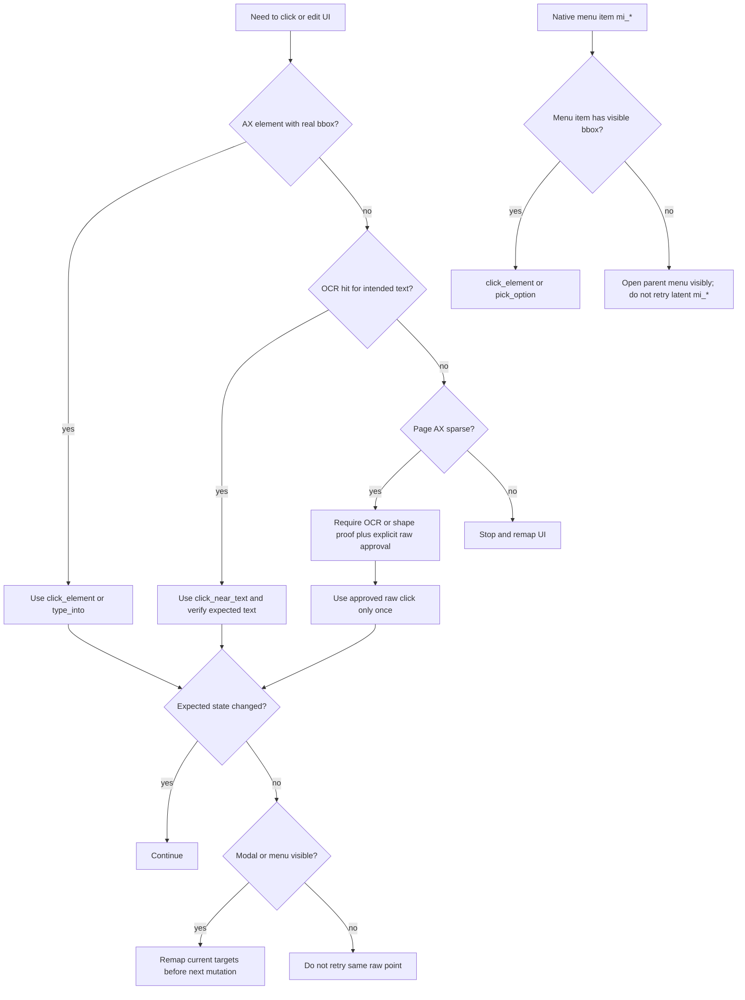

# Raw Input Code and Tangle Audit - 2026-06-23

Scope: targeted follow-up on the Firefox/Collective failure mode where Dunst could see page
text through OCR, but Firefox exposed almost no page AX nodes. The audit focuses on raw
input approval, OCR-bound clicks, latent native menu items, and the click decision tree.

Method: `cli-audit-code`, `cli-audit-tangle`, and `cli-forge-schema`.

## Summary

| Area | Score | Gate | Notes |
| --- | ---: | --- | --- |
| Code quality | 7.8/10 | Pass with debt | Safer approval contract, better failure hints, tests added. |
| Tangle | 68/100 | Pass with hotspot | No import cycle found, but raw-input policy remains a large decision hub. |
| Click decision UX | 7.5/10 | Pass | Sparse AX and latent menu failures now produce clearer next steps. |

Verification:

- `cargo fmt`
- `cargo clippy -p dunst-mcp --all-targets -- -D warnings`
- `cargo test -p dunst-mcp` passed with 153 tests.

## Fixed Bugs

1. Expired raw approval token blocked an explicitly approved retry.

   `Engine::approve` now validates synthetic raw targets structurally before granting them,
   instead of requiring the old pending gate id to still be present. Coordinate-bearing raw
   ids are still bounded to the target window. See `crates/dunst-mcp/src/engine.rs:381`
   and `crates/dunst-mcp/src/engine/raw_input_gate.rs:227`.

   This fixes the observed `approve(screen@3196,688:click) -> element not found` case after
   the pending approval response was lost or refreshed.

2. Sparse browser AX was reported as possible backdrop or blank area.

   `raw_point_risk` now detects sparse page AX and gives an actionable reason: verify through
   OCR/shape data because the browser page does not expose content nodes at that point. See
   `crates/dunst-mcp/src/engine/raw_input_gate.rs:14`.

3. Synthetic raw approvals accepted too much stringly input.

   Raw target ids now validate supported screen actions, in-window coordinates, key names,
   hotkey layout safety, type-key hash shape, and scroll direction/count/point shape. See
   `crates/dunst-mcp/src/engine/raw_input_gate.rs:227` and helpers at
   `crates/dunst-mcp/src/engine/raw_input_gate.rs:527`.

4. Latent native menu item retries had no useful stop signal.

   Failed `mi_*` menu item actions now return a failure hint that explains latent AX menu
   items and tells the agent to open the parent menu visibly or use a real on-screen item.
   See `crates/dunst-mcp/src/serve/response.rs:147`.

5. Screenshot coordinates were easy to confuse with raw click coordinates.

   `screenshot` diagnostics now include PNG pixel dimensions, target window screen-point
   bounds, x/y scale, and an explicit conversion hint. This prevents using image-pixel
   coordinates directly in `click_at`, `read_at`, or `analyze_region_ax`.

6. Raw click success with no useful UI change was too easy to over-trust.

   Successful raw clicks with only low-signal/no graph changes now include a verification
   hint telling the agent not to repeat the same raw point and to remap with screenshot
   diagnostics, OCR, shapes, or AX sampling.

7. `reveal_hover_click` hid the useful failure cause.

   The tool now preserves the original failure detail while still noting that cursor/window
   restore was attempted.

8. OCR-bound approvals were tied to unstable OCR hit ids.

   OCR ids can change from `ocr_text_68_*` to `ocr_text_67_*` between perception passes.
   Raw approval policy now scopes OCR click approval by stable text slug plus action, so one
   explicit approval covers the same OCR text/action after a refresh but remains one-shot.

9. Browser chrome AX nodes could hide sparse page AX.

   Firefox can expose toolbar/address controls while the web page itself exposes only a root
   window. Raw points in the browser content area now receive the sparse AX/OCR guidance even
   when browser chrome nodes make the full window graph look non-sparse.

10. Real cursor borrow could leave the operator with a bad mouse/button state.

    Borrowed hover UI now restores the previous frontmost process if cursor borrow fails after
    window activation. Cursor restore also defensively posts left and right MouseUp events before
    and after warping back, so interrupted real-hover/scroll/click paths do not leave a stuck
    button state. The public platform docs now match the implementation: the hardware mouse stays
    coupled during borrow because decoupling breaks web hover delivery.

## Evidence

- `valid_synthetic_raw_target_can_be_preapproved_after_pending_is_lost` covers stale pending
  raw approval recovery.
- `synthetic_raw_preapproval_rejects_off_target_points` keeps off-window raw clicks rejected.
- `synthetic_raw_preapproval_rejects_unsupported_hotkeys` keeps layout-sensitive `cmd+a`
  rejected.
- `raw_point_risk_reports_sparse_ax_instead_of_backdrop_for_browser_canvas_pages` covers the
  Firefox sparse-AX page case.
- `failed_latent_menu_item_includes_open_menu_hint` covers the latent menu stop hint.
- `png_dimensions_reads_ihdr_size` covers screenshot PNG geometry extraction.
- `successful_raw_click_without_meaningful_diff_warns_not_to_retry_same_point` covers the
  no-op raw click loop guard.
- `ocr_raw_input_gate_uses_synthetic_ocr_target_ids` covers approval reuse across refreshed
  OCR ids for the same text/action.
- `browser_content_raw_point_reports_sparse_ax_even_when_chrome_nodes_exist` covers Firefox
  chrome nodes plus sparse page content.
- macOS cursor recovery is covered by compile-time verification on the platform path and by the
  end-to-end `cargo clippy -p dunst-mcp --all-targets -- -D warnings` / `cargo test -p dunst-mcp`
  run. It is still a live-UI behavior that should be rechecked manually after MCP restart.

## Residual Findings

| Severity | Finding | Next correction |
| --- | --- | --- |
| T2 | `raw_input_gate.rs` is still a policy hub at about 600 LOC. | Extract typed `SyntheticRawTarget` parsing and validation into `engine/raw_input/policy.rs`. |
| T2 | `find_ocr_text` is window-scoped, so it can still match stale/background text when a modal overlaps the page. | Add optional region/modal scoping to OCR search and prefer modal bbox when detected. |
| T2 | The action choice tree is implicit across Dunst tool descriptions, risk hints, and response hints. | Keep the Mermaid decision tree below as the contract and convert the key branches into tests. |
| T3 | Sparse AX detection uses a small count heuristic. | Revisit only if false positives appear in real pages; current behavior is safer than backdrop wording. |

## Application Architecture

```mermaid
flowchart TB
    client[MCP client] --> dispatch[serve dispatch]
    dispatch --> read[Read tools: AX, OCR, state, screenshots]
    dispatch --> raw[Raw tools: click, keyboard, scroll, file select]

    read --> graph[Scene graph and affordance graph]
    graph --> response[Response shaping and hints]

    raw --> risk[raw_input_gate risk and target validation]
    risk --> approval{approval needed?}
    approval -- no --> execute[platform executor]
    approval -- yes --> pending[pending approval response]
    pending --> approve[approve id]
    approve --> valid{target valid and bounded?}
    valid -- no --> reject[reject]
    valid -- yes --> grant[grant count or one-shot approval]
    grant --> raw

    execute --> refresh[refresh and diff]
    refresh --> response
    response --> client
```

## Click Choice Tree



## Next Work

1. Add a typed `SyntheticRawTarget` enum and move parsing out of `Engine`.
2. Add region-scoped OCR lookup for modals and context menus.
3. Add a small decision-tree test fixture for `AX -> OCR -> sparse AX -> raw approval`.
4. Keep raw coordinate approvals valid only when current window geometry still contains the
   target point.
